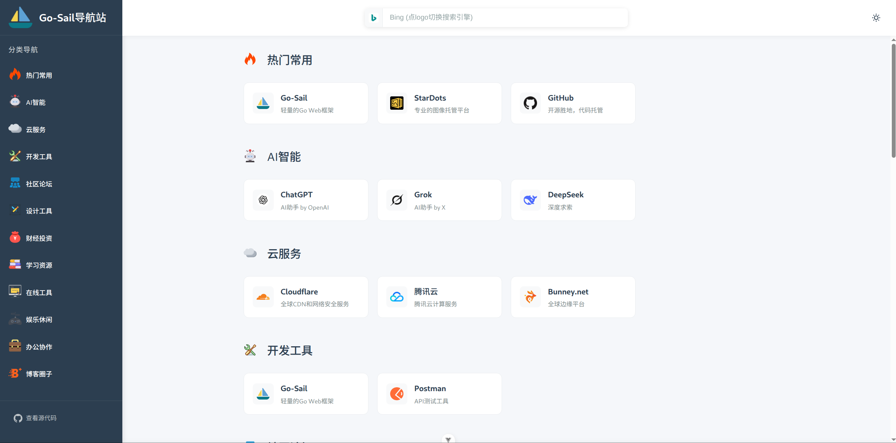

# Go-Sail示例项目 - 导航站Server

> 一个简洁美观的个人导航网站，支持分类管理和自定义收藏夹


## 效果预览
示例站点: [https://nav.go-sail.dev](https://nav.go-sail.dev)



### 本地开发

#### 前端工程  
> 仓库地址：https://github.com/go-sail/nav-ui

1. **克隆项目**
```bash
git clone https://github.com/go-sail/nav-ui.git
cd nav-ui
```

2. **安装依赖**
```bash
npm install
```

3. **启动开发服务器**
```bash
npm run dev
```

4. **访问**
- 导航页面：`http://localhost:5173`
- 管理后台：`http://localhost:5173/admin`

#### 后端工程  
> 仓库地址：https://github.com/go-sail/nav-server  

1. **克隆项目**
```bash
git clone https://github.com/go-sail/nav-server.git
cd nav-server
```  

2. **安装依赖**
```bash
go mod tidy
```  

3. **启动基础服务**
```bash
cd infra
docker compose up -d
```  

4. **启动服务**
```bash  
go run main.go admin -c config.nav-server.yaml
```


## 🛠️ 开发命令

```bash
# 开发模式
npm run dev

# 构建生产版本
npm run build

# 预览生产版本
npm run preview

# 代码检查和修复
npm run lint
```  
> 构建生产版本前,请将.env.example拷贝一份为.env.production,并配置好里面的设置信息